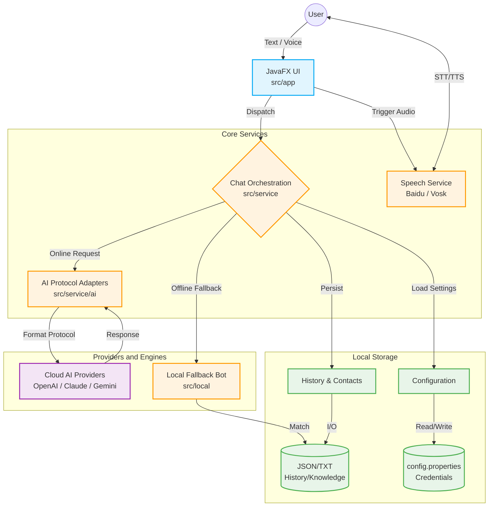

# EchoSoul


EchoSoul is a JavaFX desktop chat application featuring persona-based conversations, local history management, pluggable AI provider access, and optional speech capabilities.

Built with modern Java engineering practices, it ensures data privacy through local storage and offers a seamless fallback mechanism when offline.

<br>

## ✨ Features

- **🎭 Persona-Based Chat**: Create and switch between different AI characters with custom system prompts and avatars.
- **🔌 Pluggable AI Providers**: Built-in protocol adapters for OpenAI-compatible, Anthropic, and Gemini APIs. Easily switch models via configuration.
- **🛡️ Local Fallback Engine**: Includes a built-in offline chatbot and knowledge base. Never lose the ability to chat, even without an internet connection.
- **🎙️ Voice Interaction**: Optional STT (Speech-to-Text) via Baidu/Vosk and TTS (Text-to-Speech) integrations for hands-free conversations.
- **💾 Local First & Private**: All chat histories, credentials, and settings are stored strictly on your local machine.
- **🚀 Native Ready**: Configured for `jpackage` to effortlessly build standalone Windows `.exe` installers.

## 🏗️ Architecture



- `src/app`: JavaFX UI and application bootstrap.
- `src/service`: Chat orchestration, configuration, contacts, history, and UI resource services.
- `src/service/ai`: Provider presets and protocol adapters (OpenAI, Anthropic, Gemini).
- `src/local`: Local fallback chatbot and built-in knowledge resources.
- `src/speech`: Optional Baidu and Vosk speech integrations.

## 🛠️ Tech Stack

- Java 21+ / JavaFX
- Maven
- Gson / OkHttp
- Baidu Speech SDK / Vosk

## 🚀 Quick Start

### Requirements
- JDK 21 or newer
- Maven 3.9 or newer

### Setup
1. Clone the repository.
2. Start the app once, or manually copy `config.example.properties` to a root-level `config.properties`.
3. Fill in the AI provider settings and any optional speech credentials you want to use.
4. Run the application:

```powershell
mvn javafx:run
```

*(Alternatively, use the helper script: `./scripts/run.bat`)*

## ⚙️ Configuration

Public templates live in:
- `resources/config.example.properties`
- `config.example.properties`

Writable runtime settings live in `config.properties` in the repository root or beside the packaged app.

**Optional Integrations:**
- **AI Provider**: set `ai.provider.preset`, `ai.protocol`, `ai.api.key`, `ai.base.url`, and `ai.model`.
- **Baidu Speech**: set `baidu.app.id`, `baidu.api.key`, and `baidu.secret.key`.
- **Vosk Offline Speech**: place a compatible speech model in a top-level `model/` directory.

> **Note:** If no online AI provider is configured, the app will automatically fall back to its local reply logic.

## 📦 Build & Native Packaging

Package the project into a Fat JAR with dependencies:

```powershell
mvn -B -DskipTests clean package
```

This produces `target/jpackage-input/echosoul-0.1.1.jar` and `target/jpackage-input/libs/`.

**Native Windows App Image:**
After packaging, you can build a standalone Windows app image or installer using `jpackage`:

```powershell
jpackage --type app-image --dest target/installer --input target/jpackage-input --name EchoSoul --main-class app.Main --main-jar echosoul-0.1.1.jar
```

## 📝 Open-Source Notes

- Private credentials are **never** committed.
- Runtime data (chat history, generated audio, logs) are ignored via `.gitignore`.
- Before wider public redistribution, please review bundled images and any third-party assets for license compliance.

## 🤝 Contributing
See `CONTRIBUTING.md` for details on how to help out.

## 📄 License
This project is released under the MIT License. See `LICENSE`.
