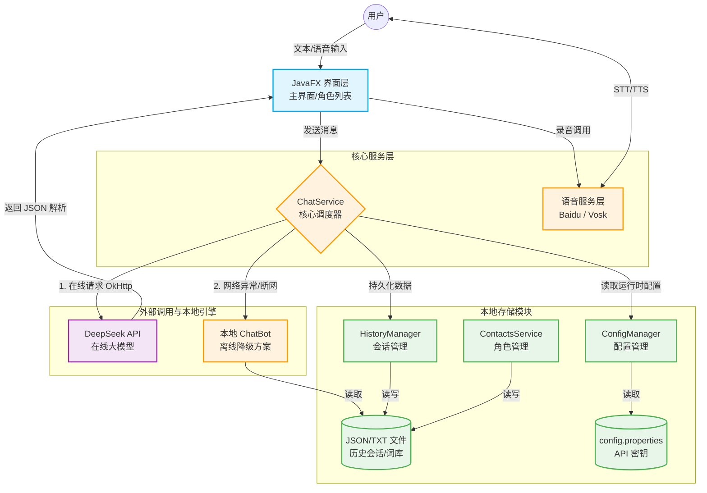

# EchoSoul

EchoSoul is a JavaFX desktop chat application with persona-based conversations, local history management, optional online model access, and optional speech features.

This repository has been prepared for a minimal open-source release:

- standard Maven build entry
- sanitized public configuration
- root-level project documentation
- CI build workflow
- ignore rules for local runtime data and generated files

## Tech Stack

- Java 21+
- JavaFX
- Maven
- Gson
- Baidu Speech SDK

## Architecture



## Requirements

- JDK 21 or newer
- Maven 3.9 or newer

## Quick Start

1. Install JDK 21+ and Maven 3.9+.
2. Create a local `config.properties` in the repository root based on `config.example.properties`.
3. Fill in any external service credentials you want to use.
4. Run:

```powershell
mvn javafx:run
```

Or use the helper script:

```powershell
.\scripts\run.bat
```

## Build

Package the project:

```powershell
mvn -B -DskipTests clean package
```

Or use:

```powershell
.\scripts\compile.bat
```

## Configuration

Public defaults live in:

- `resources/config.properties`
- `config.example.properties`

Local overrides should live in:

- `config.properties` in the repository root

Optional integrations:

- DeepSeek: set `deepseek.api.key`
- Baidu speech: set `baidu.app.id`, `baidu.api.key`, and `baidu.secret.key`
- Vosk offline speech: place a compatible speech model in a top-level `model/` directory if you want offline recognition

If no DeepSeek key is provided, the app can still fall back to its local reply logic.

## Repository Layout

```text
.
|-- .github/workflows/      CI build workflow
|-- docs/                   release notes and maintenance docs
|-- resources/              bundled config and static assets
|-- scripts/                helper scripts for build and run
|-- src/                    Java source code
|-- CHANGELOG.md
|-- config.example.properties
|-- LICENSE
|-- pom.xml
`-- README.md
```

## Open-Source Notes

- Private credentials are not committed.
- Runtime data such as chat history and generated audio files are ignored.
- Before wider public redistribution, review bundled images and any third-party assets for license compliance.

## Contributing

See `CONTRIBUTING.md`.

## License

This project is released under the MIT License. See `LICENSE`.
